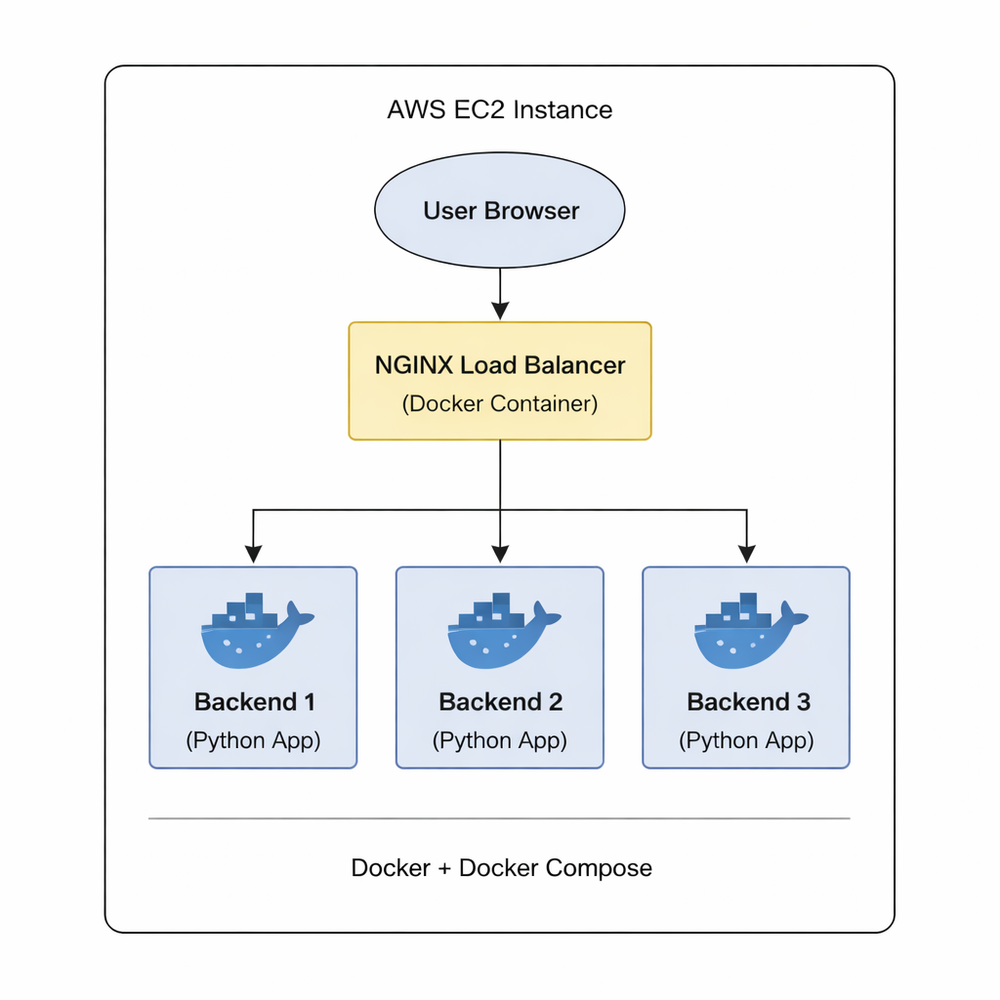
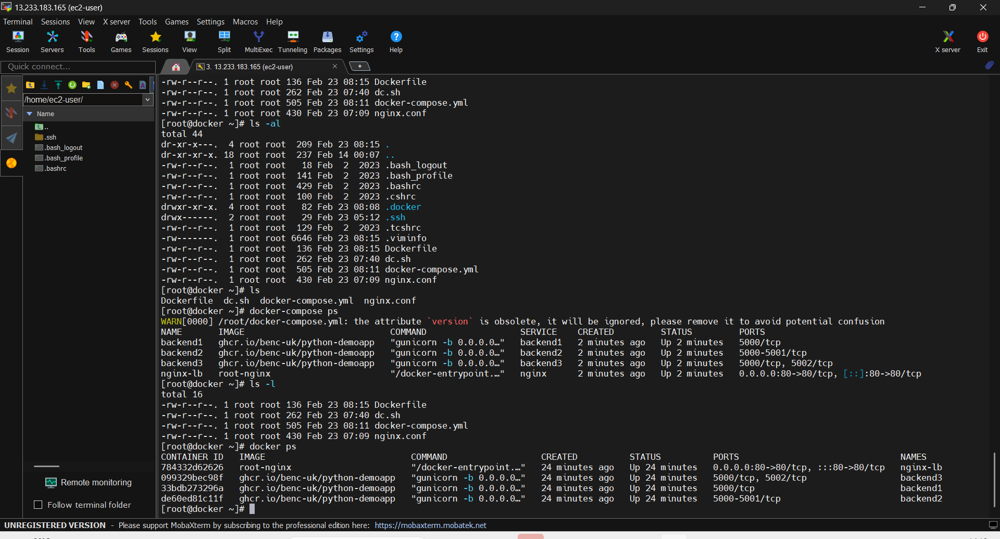
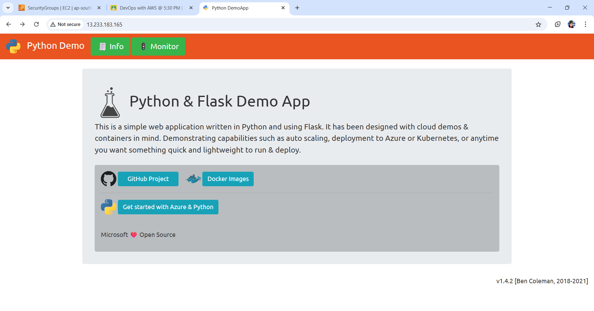
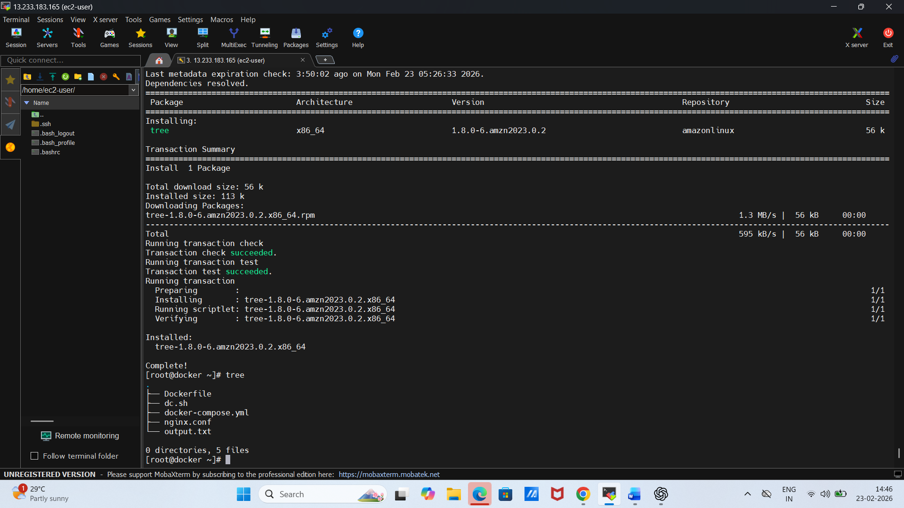
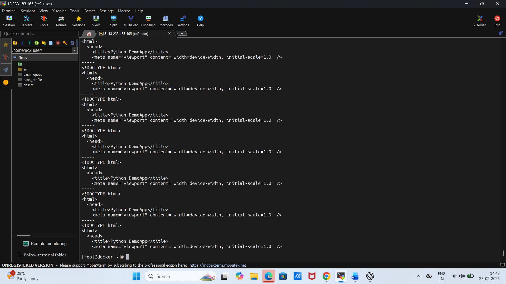

# NGINX Load Balancer DevOps Project 🚀

## 📌 Project Overview

This project demonstrates a containerized application deployed using **Docker Compose** with an **NGINX Load Balancer** to achieve high availability.

## 🛠 Tech Stack

* Docker
* Docker Compose
* NGINX
* Linux (EC2)
* Git & GitHub

---

## 🏗 Architecture

---

## ✅ All Containers Running

---

## 🌐 Application Running

---

## ❌ Backend Stopped Test

---

## ✅ App Still Working (Load Balancing Proof)

.png)

---

## 📁 Docker Compose Structure

---

## 🔎 Load Balancer Curl Test

---

## 🎯 Key Learning

* Container orchestration using Docker Compose
* Reverse proxy & load balancing with NGINX
* Fault tolerance testing
* DevOps project structuring

---

⭐ Created as part of DevOps hands-on learning.

